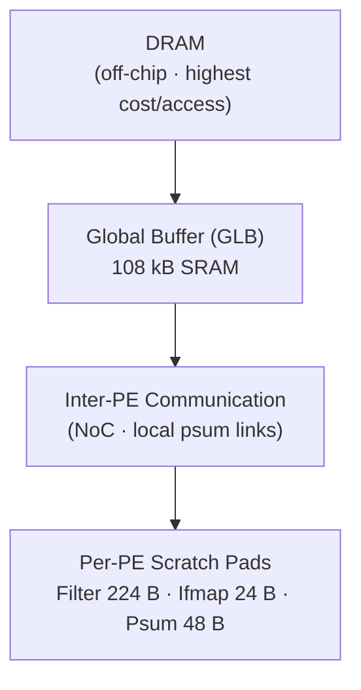

> **Version note:** This is **Eyeriss v1** — the JSSC 2017 journal version of the fabricated 65 nm chip (extended from ISSCC 2016). It is distinct from two related papers: the ISCA 2016 companion ("Eyeriss: A Spatial Architecture for Energy-Efficient Dataflow...", cited here as [32]), which develops the dataflow taxonomy and energy model in depth, and **Eyeriss v2** (Chen et al., 2019), a separate architecture not yet in the wiki. Do not merge any of these into this page.

## Summary

Eyeriss is a fabricated 65 nm CNN inference accelerator that optimizes for the energy efficiency of the *entire system* — chip plus off-chip DRAM — rather than chip power alone. Its core contribution is the row-stationary (RS) dataflow on a reconfigurable 168-PE spatial array with a four-level memory hierarchy, which maximizes local reuse of filters, ifmaps, and partial sums simultaneously to minimize expensive DRAM and global-buffer accesses. Measured silicon results on AlexNet and VGG-16 made it the reference point for dataflow-driven accelerator design.

## Contributions

- The **[[row-stationary]] (RS) dataflow**: maps any CNN layer shape onto the PE array by keeping 1-D convolution row primitives stationary in PEs, jointly optimizing reuse of all three data types (filter weights, ifmap values, psums) rather than privileging one.
- A **spatial architecture with a four-level memory hierarchy** (DRAM → 108-kB global buffer → inter-PE communication → per-PE scratch pads), with PEs that run independently rather than in systolic lock-step (p.3, §III-B).
- A **custom NoC** (global input network with hierarchical X/Y buses, global output network, local psum links) supporting single-cycle multicast with reconfigurable (row, col) tag IDs instead of a mesh, sized to the RS dataflow's delivery patterns (p.7–8, §V-B).
- **Run-length compression (RLC)** of fmaps over the DRAM interface and **zero-gating of the PE datapath** to exploit ReLU-induced sparsity (p.6, §IV-B; p.9, §V-C).
- Measured results from fabricated silicon benchmarked on full, publicly available CNNs (AlexNet, VGG-16) — including DRAM access counts, which most prior accelerator papers did not report (p.1, §I).

## Method

A CNN layer is decomposed into **1-D convolution primitives** — one row of filter weights against one row of ifmap values, producing one row of psums — and each primitive maps to one PE, where the row pair stays stationary in local scratch pads (filter spad 224 B SRAM, ifmap 24 B and psum 48 B registers) (p.3, §IV-A; p.8, §V-C). A **PE set** runs a 2-D convolution: filter rows are reused horizontally across the set, ifmap rows diagonally, and psums accumulate vertically (p.4, Fig. 4). Sets larger than the 12×14 array are strip-mined; small sets are replicated across the array (r×t sets over channels and filters), and each PE can interleave p×q primitives from q channels of p filters by enlarging spads (p.4–5, §IV-A). Work beyond what fits spatially is scheduled as **processing passes**, with the [[memory-hierarchy-energy-cost|global buffer]] storing ifmaps and psums between passes in reconfigurable proportions so psums never spill to DRAM before reduction (p.5–6, §IV-A).

Mapping parameters for a given layer shape are determined offline by an energy-cost optimization (developed in the ISCA 2016 companion [32]) and loaded via a 1794-bit scan chain in under 100 µs (p.3, §III-B). Data statistics are exploited two ways: RLC-encoded fmaps in DRAM, and a zero buffer in each PE that gates the MAC datapath when an ifmap value is zero (p.6, §IV-B; p.9, §V-C).

Note for spot-checkers: the quantitative dataflow taxonomy comparison (against [[weight-stationary]], [[output-stationary]], [[no-local-reuse]]) and the per-level energy ratios of the storage hierarchy live in the ISCA 2016 companion paper, not here — this paper carries only the summary claim below.

## Results

Page anchors refer to PDF pages 1–12 (journal pages 127–138).

- RS dataflow is 1.4–2.5× more energy efficient than existing dataflows from previous work on AlexNet (p.3, §IV-A; detailed comparison delegated to ISCA 2016 companion [32]).

**Chip specification** — all values from p.9, Table IV and §VI:

| Parameter | Value |
|-----------|-------|
| Process | TSMC 65 nm LP |
| Die size | 4.0 × 4.0 mm |
| PE count | 168 |
| Global buffer | 108 kB SRAM |
| Total on-chip SRAM | 181.5 kB |
| Precision | 16-bit fixed-point |
| Core clock | 100–250 MHz |
| Peak throughput | 33.6 GMACS @ 200 MHz / 1 V |
| Core area: storage share | GLB + spads = 2/3 of core area; multipliers + adders = 7.4% (p.9, §VI, Fig. 15) |
| Spad vs GLB | Spads: 2.5× GLB area, 1.5× less aggregate capacity (p.9, §VI, Fig. 15) |

Four-level memory hierarchy with access-cost ordering from highest (DRAM) to lowest (spads), per §I and §IV-B (p.2, p.6):

**Measured benchmark results** (both at 1 V):

| Metric | AlexNet (N=4) | VGG-16 (N=3) | Source |
|--------|--------------|--------------|--------|
| Throughput | 34.7 frames/s | 0.7 frames/s | p.9, §VI-A; p.11, §VI-B |
| Effective compute | 23.1 GMACS | — | p.9, §VI-A |
| Chip power | 278 mW | 236 mW | p.9, §VI-A; p.11, §VI-B |
| Energy efficiency | 83.1 GMACS/W | — | p.9, §VI-A |
| DRAM traffic | 15.4 MB / batch | 321.1 MB / batch | p.10, Table V; p.11, Table VI |
| DRAM access/MAC | 0.0029 (37.4/pixel) | 0.0035 (1066.6/pixel) | p.10, Table V; p.11, Table VI |
| GLB accesses | 208.5 MB | — | p.10, Table V |

- Voltage scaling on AlexNet: maximum throughput 45 frames/s at 1.17 V; maximum energy efficiency 122.8 GMACS/W at 0.82 V (p.10–11, Fig. 17).
- System-energy framing: ALUs account for <10% of measured chip power while data-movement components (spads, GLB, NoC) reach up to 45%, and chip power alone excludes DRAM — the paper's argument for why DRAM access count, reported above, is the system-level energy metric (p.10–11, Fig. 16; p.6, §IV-B calls DRAM "the most energy consuming data movement per access").
- RLC compression: fmap DRAM accesses cut by nearly 30% in CONV1 up to nearly 75% in CONV5 of AlexNet; overall per-layer DRAM access reduction 1.2×–1.9× (p.6, §IV-B; p.7, Fig. 9).
- Sparsity: ~40% of CONV2 and ~75% of CONV5 ifmap values are zero in AlexNet; zero-gating saves 45% of PE power versus a PE without gating logic (p.6, §IV-B; p.9, §V-C).

![[assets/chen2017/fig4.png]]
*Fig. 4 (p.4): Dataflow in a PE set for 2-D convolution — filter rows reused horizontally, ifmap rows reused diagonally, psum rows accumulated vertically.*

![[assets/chen2017/fig16.png]]
*Fig. 16 (p.10–11): Chip power breakdown for CONV1 and CONV5 of AlexNet; scratch pads dominate (42.5%/33.1%), multiplier & adder only 8.9%/3.0% — confirming data movement as the dominant energy cost.*

## Highlights

<!-- MACHINE-MAINTAINED, HUMAN-SOURCED — verbatim Zotero annotations via pull_annotations.py only; replaced wholesale on re-pull; never summarized, paraphrased, or authored by Claude (§6) -->

> proposed processing dataflow, called row stationary (RS), on a spatial architecture with 168 processing elements (p.1)

> maximally reusing data locally to reduce expensive data movement (p.1)

> a compute scheme, called a dataflow, that can support a highly parallel compute paradigm while optimizing the energy cost of data movement from both on-chip and off-chip (p.1)

> Data movement can exploit the low-cost levels, such as the PE scratch pads (spads) and the inter-PE communication, to minimize data accesses to the high-cost levels, including the large on-chip global buffer (GLB) and the off-chip DRAM (p.2)

*This means that the flow of data must allow reuse so that the low cost levels actually get used*

> Fig. 3. Processing sequence of a 1-D convolution primitive in a PE (p.3)

> Therefore, even though the 168 PEs are identical and run under the same core clock, their processing states do not need to proceed in lock steps, i.e., not as a systolic array. (p.3)

> Compared with existing dataflows from previous works, the RS dataflow is 1.4–2.5 times more energy efficient in AlexNet, a widely used CNN (p.3)

*Because there are so many memory hierarchies. The low-cost memory gets of lots of values through it*

> Convolutional Reuse (p.3)

> Filter Reuse (p.3)

> Ifmap Reuse (p.3)

> one row of psums (p.3)

*Weights are kept, you just slide the input maps through and psums accumulate and drain through.*

> Fig. 4. Dataflow in a PE set for processing a 2-D convolution. (p.4)

> In a set, each row of filter is reused horizontally, each row of ifmap is reused diagonally, and rows of psum are accumulated vertically. (p.4)

> Equivalently, this means each PE set is running multiple 2-D convolutions on different filters and channels. (p.5)

> This requires increasing the ifmap and filter spad size. (p.5)

*Spads are register files, so making them larger requires area tradeoff.*

> Multiple ifmaps can also be processed sequentially through the array. The amount of computation done in this fashion is called a Processing Pass. In a pass, each input data are read only once from the GLB, and the psums are stored back to the GLB only once when the processing is finished. (p.5)

> the GLB allocation for ifmaps and psums has to be reconfigurable to store them in different proportions. (p.6)

> In AlexNet, almost 40% of ifmap values of CONV2 are zeros on average, and it goes up to around 75% at CONV5. In addition to the fmap, a recent study has also shown that 16%–78% filter weights in a CNN can be pruned to zero (p.6)

> The computed ofmaps are read from the GLB, processed by the ReLU module optionally, compressed by the RLC encoder, and transmitted to the DRAM. (p.6)

> can be saved by nearly 30% in CONV1, and nearly 75% in CONV5. (p.6)

> allocated for filter weights to compensate for insufficient off-chip traffic bandwidth (p.7)

> To avoid this overhead, we chose to implement a custom NoC for the required data delivery patterns that is optimized for latency, bandwidth, energy, and area. (p.7)

> optimized for a single-cycle multicast from the GLB to a group of PEs (p.7)

*Which is why they use bus instead of P2P. It needs to reach many of the PEs*

> The unmatched X-buses and PEs are gated to save energy (p.8)

> The selection is static within a layer, which is controlled by the scan chain configuration bits and only depends on the dataflow mapping of the CNN shape. (p.8)

> filter spad is implemented in a 224-b ×16-b SRAM (p.8)

> ifmap and psum spads of size 12 b ×16 b and 24 b ×16 b, respectively, are implemented using registers. (p.8)

> Compared with the PE design without the data gating logic, it can save the PE power consumption by 45%. (p.9)

> DRAM access is 15.4 MB, or 0.0029 access/MAC (p.10)

*Do they compare this with other naive implementations? How can I know this is better?*

## Limitations

- Benchmarks **CONV layers only** — fully connected layers (the majority of AlexNet's weights) are never evaluated, and the RS reuse argument is weakest there since convolutional reuse vanishes.
- The headline 1.4–2.5× dataflow comparison is carried over from the ISCA companion's simulation framework, not re-measured against alternative dataflows in silicon.
- RLC is applied to fmaps only; the paper concedes filter-weight traffic could also be compressed but does not implement it (p.6).
- DRAM traffic is not overlapped with computation (total latency 115.3 ms vs. 103.5 ms processing latency on AlexNet, p.10, Table V); the claim that overlap is achievable "at negligible cost" is asserted, not demonstrated.
- Mapping parameters are produced by an offline optimization per layer shape; the cost and generality of that optimization step live outside the chip evaluation.
- Maximum natively supported filter height is 12; nonstandard shapes beyond Table IV's ranges require strip-mining workarounds or are unsupported (p.9, Table IV).

## Connections

- [[eyeriss]] — the chip this paper presents; system page covers v1 silicon specifics.
- [[dataflow]] — this paper is the wiki's anchor for the dataflow-taxonomy framing of accelerator design.
- [[row-stationary]] — the dataflow this paper introduces and implements.
- [[weight-stationary]] / [[output-stationary]] / [[no-local-reuse]] — the competing dataflow classes RS is compared against (comparison itself in the ISCA 2016 companion).
- [[memory-hierarchy-energy-cost]] — the four-level hierarchy and its energy-per-access ordering is the premise the whole design optimizes against.
- [[alexnet]] — primary measured benchmark (5 CONV layers).
- [[vgg-16]] — second measured benchmark (13 CONV layers).
- [[imagenet]] — the 1000-class task both benchmark CNNs target.
- [[caffe]] — framework Eyeriss was integrated into for the live demo system.
- [[2009-williams-roofline]] — Roofline is the throughput-side analytical frame for why minimizing off-chip DRAM traffic (this paper's energy argument via [[memory-hierarchy-energy-cost]]) matters; reuse here = higher [[operational-intensity]] there.

## Open Questions

- How does the RS dataflow perform on fully connected layers, where convolutional reuse vanishes and filter reuse exists only across the batch dimension?
- With 16–78% of filter weights prunable to zero (p.6), how much additional DRAM-access reduction would weight-side compression deliver on top of fmap-only RLC?
- The paper claims DRAM traffic can be fully overlapped with processing "at negligible cost" (p.10) — what control changes does that actually require, and does it hold for VGG-scale fmaps where ramp-up dominates?
- Which of RS's assumptions about reuse structure (convolutional weight/input/psum reuse) break for attention workloads, and what replaces the dataflow argument there?

## My Take

<!-- HUMAN-OWNED — never overwrite or append to this section -->
Extremely interesting paper. From my understanding, it revolutionized the CNN architecture field, which either had naive implementations or followed some other dataflow. Some thoughts:
- I wish it compared the statistics to other chips (naive approaches). I would've liked to see how much DRAM access a basic CPU or GPU at the time would've used.
- Although important then, many of the issues have been solved in round-about ways, which I will go over soon.

## My Notes

<!-- HUMAN-OWNED — never overwrite or append to this section -->
